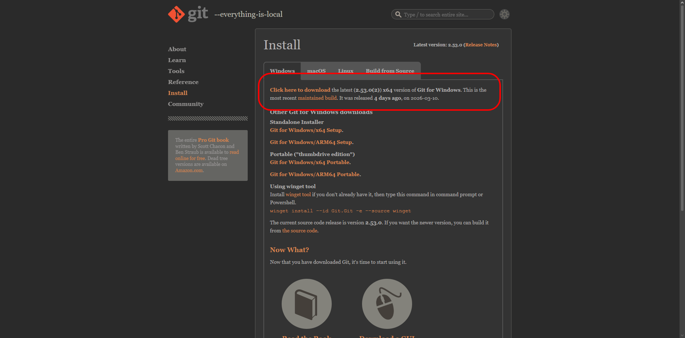
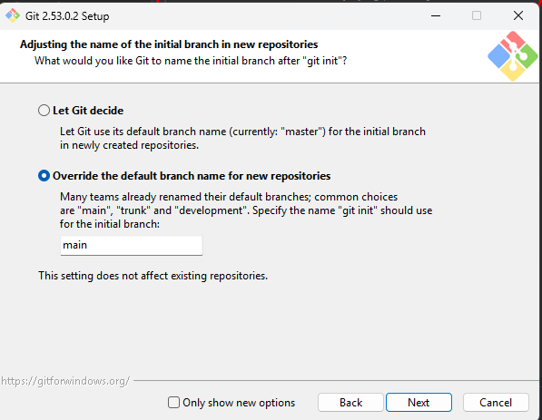

# Guia Git - Primeiros Passos e Comandos Essenciais

Este guia foi criado para ajudar você a configurar o Git e entender os comandos básicos necessários para participar do desafio **30 Dias de CSS**.

## 1. Instalação do Git

### Windows
1. Baixe o instalador oficial em [git-scm.com](https://git-scm.com/download/win). [veja os videos de tutorial abaixo em VIDEOS](#3-videos-de-apoio)

2. Execute o instalador e siga as instruções (as opções padrão geralmente são suficientes).
3. Substitua **master** por **main**

4. Abra o **Prompt de Comando**, **PowerShell** ou **Git Bash** e verifique a instalação, caso não funcione tente reiniciar o PC:
   ```bash
   git --version
   ```

### macOS
1. Se você tem o [Homebrew](https://brew.sh/) instalado:
   ```bash
   brew install git
   ```
2. Ou baixe o instalador em [git-scm.com](https://git-scm.com/download/mac).

### Linux (Ubuntu/Debian)
1. Use o gerenciador de pacotes:
   ```bash
   sudo apt update
   sudo apt install git
   ```

---

## 2. Configuração Inicial

Antes de começar a salvar seu progresso (commitar), você precisa se identificar para que o Git saiba quem é o autor das mudanças:

```bash
git config --global user.name "Seu Nome"
git config --global user.email "seuemail@exemplo.com"
```

É possivel alterar autor por repositório:

```bash
git config user.name "Seu Nome"
git config user.email "seuemail@exemplo.com"
```

---

## 3. Videos de apoio

[O QUE É GIT E GITHUB? - definição e conceitos importantes 1/2](https://www.youtube.com/watch?v=DqTITcMq68k)
Faça as anotações do que foi comentado

[COMO USAR GIT E GITHUB NA PRÁTICA! 2/2](https://www.youtube.com/watch?v=UBAX-13g8OM)

[INSTALANDO GIT E GITHUB NO PC](https://www.youtube.com/watch?v=NgWExh3bswg)

[CRIANDO CONTA NO GITHUB](https://www.youtube.com/watch?v=1QTi8nIlK1o)

[PRIMEIRO REPOSITORIO GIT E GITHUB](https://www.youtube.com/watch?v=P0Hvrf8T3zo)

---
## 4. Comandos Básicos do Dia a Dia

### Clonar um repositório
Para baixar este projeto pela primeira vez para sua máquina:
```bash
git clone https://github.com/Micael-Macedo/30diasDeCSS.git
```

### Verificar o status
Veja quais arquivos foram modificados ou ainda não foram salvos:
```bash
git status
```

### Adicionar alterações (Stage)
Prepare os arquivos para serem salvos:
```bash
git add .          # Adiciona todas as alterações da pasta atual
git add arquivo.css  # Adiciona um arquivo específico
git add ./desafios/ # Adiciona uma pasta com todas as alterações internas

```

### Salvar alterações (Commit)
Crie uma "foto" do estado atual do seu código com uma mensagem explicativa:
```bash
git commit -m "Adiciona estilo do botão para o dia 04"
```

### Enviar para o servidor (Push)
Envie seus commits locais para o repositório no GitHub:
```bash
git push origin nome-da-sua-branch
```

### Baixar atualizações (Pull)
Traga as últimas mudanças do servidor para o seu computador:
```bash
git pull origin main
```

---

## 5. Trabalhando com Branches (Ramos)

Branches são fundamentais para organizar seus desafios diários sem afetar o código principal (`main`).

### Criar e entrar em uma nova branch:
```bash
git checkout -b branch_(nome_usuario)
```

### Listar todas as suas branches:
```bash
git branch
```

### Voltar para a branch principal:
```bash
git checkout main
```

---

## 6. Fluxo de Trabalho Recomendado

Para cada novo desafio diário, siga estes passos:
OBS: antes de prosseguir verifique se sua branch pessoal foi crianda utilizando o comando
```bash
git checkout -b branch_(nome_usuario)
```

1. **Atualize sua branch pessoal:**
   ```bash
   git checkout branch_micael
   git pull origin branch_micael
   ```
2. **Crie uma branch para o dia:**
   ```bash
   git checkout -b desafio/dia-XX
   ```
3. **Faça o seu desafio (HTML/CSS).**
4. **Salve seu progresso:**
   ```bash
   git add .
   git commit -m "Desafio Dia XX concluído"
   ```
5. **Envie para o GitHub:**
   ```bash
   git push origin desafio/dia-XX
   ```
6. **Retorne a sua branch pessoal para os próximos desafios**
   ```bash
   git checkout branch_micael
   ```

Para entender como abrir um **Pull Request**, consulte o [GUIA_CONTRIBUICAO.md](GUIA_CONTRIBUICAO.md).
